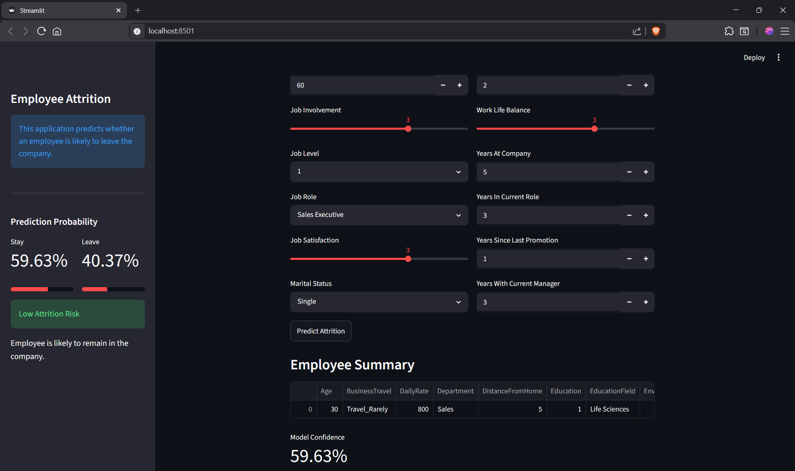
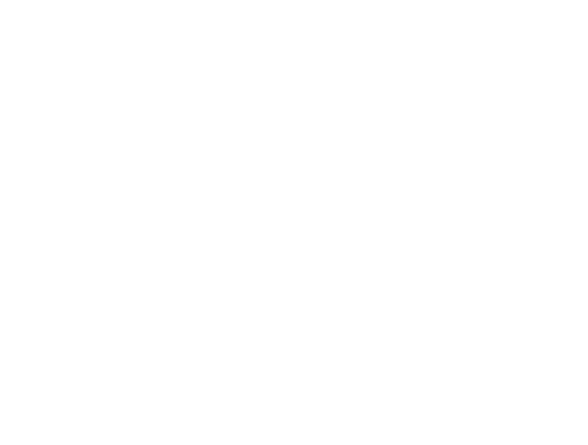
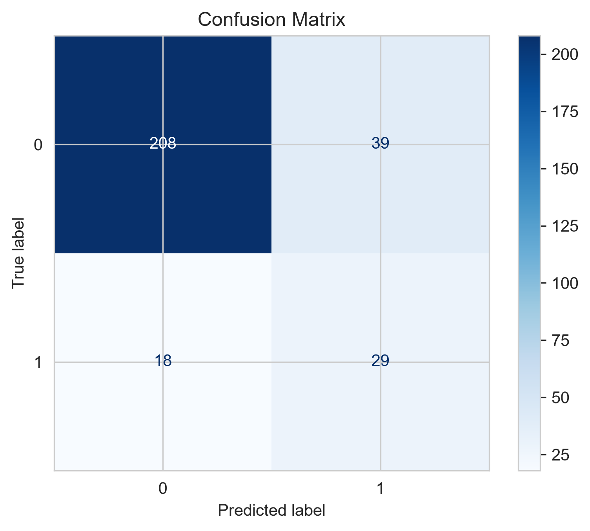
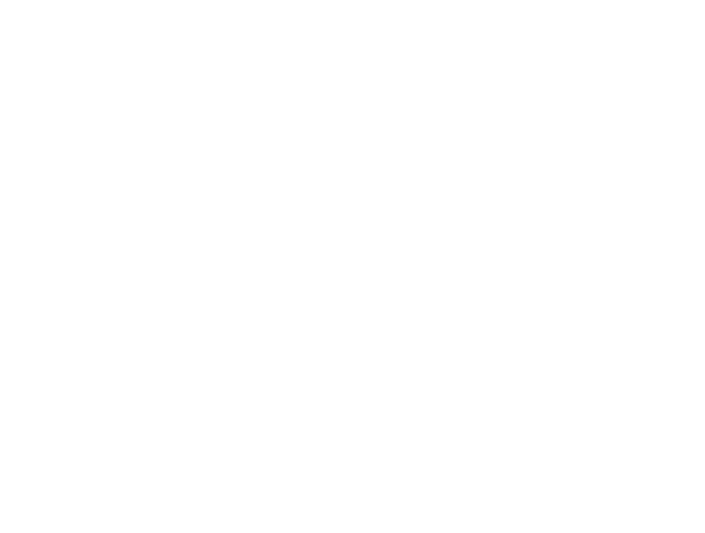

# Employee Attrition Prediction using Machine Learning

An end-to-end Machine Learning project that predicts whether an employee is likely to leave a company based on HR-related attributes. The project includes data preprocessing, exploratory data analysis, handling imbalanced datasets, model training, hyperparameter tuning, explainability using SHAP, and deployment with Streamlit.

---

## Streamlit Application

---

## Project Overview

Employee attrition is a major challenge for organizations. Losing experienced employees increases recruitment costs, training expenses, and reduces overall productivity.

This project uses Machine Learning to predict employee attrition so that HR departments can identify employees who are at a higher risk of leaving and take proactive measures.

---

## Dataset

- **Dataset:** IBM HR Analytics Employee Attrition Dataset
- **Records:** 1470 employees
- **Features:** 30 input features
- **Target Variable:** Attrition (Yes / No)

---

## Features Used

Some important features include:

- Age
- Monthly Income
- Job Satisfaction
- Environment Satisfaction
- OverTime
- Department
- Job Role
- Business Travel
- Years at Company
- Distance From Home
- Work-Life Balance
- Total Working Years
- Stock Option Level
- Monthly Rate
- Training Times Last Year
- ... and more

---

## Machine Learning Workflow

- Data Cleaning
- Exploratory Data Analysis (EDA)
- Feature Engineering
- Data Preprocessing using ColumnTransformer
- Handling Imbalanced Data using SMOTE
- Model Training
- Hyperparameter Tuning using RandomizedSearchCV
- Model Explainability using SHAP
- Model Deployment using Streamlit

---

## Algorithms Used

- Logistic Regression
- Random Forest Classifier
- Random Forest with Hyperparameter Tuning
- SMOTE for Class Balancing

---

## Feature Importance

The Random Forest model identified **Monthly Income**, **Age**, **Total Working Years**, **Years at Company**, and **OverTime** as some of the most influential features for predicting employee attrition.

---

## Confusion Matrix

---

## SHAP Explainability

SHAP values were used to explain individual model predictions, improving model transparency and interpretability.

---

## Tech Stack

- Python
- Pandas
- NumPy
- Scikit-Learn
- Imbalanced-Learn (SMOTE)
- Matplotlib
- Seaborn
- SHAP
- Streamlit
- Joblib

---

## Model Performance

|----------|---------|
| Metric   | Score   |
|----------|---------|
| Accuracy | **83%** |
| Precision| **47%** |
| Recall   | **55%** |
| F1-Score | **0.51**|
|----------|---------|
---

## Installation

Clone the repository

